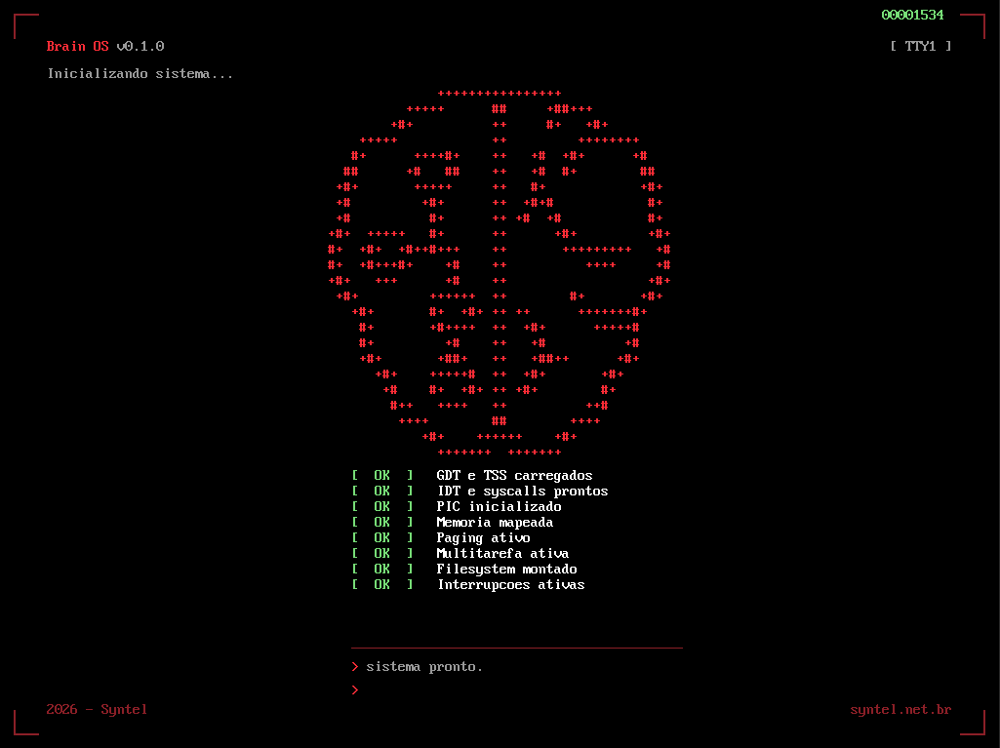

<p align="center">
  
</p>

# brain-os

Sistema operacional bare-metal x86 (32-bit), escrito do zero para fins educacionais. Vai do `BIOS carrega 512 bytes` até um programa de usuário isolado rodando do disco em ring 3 — passando por interrupções, memória virtual, multitarefa e filesystem.

## O que já existe

- **Boot** — bootloader 16-bit, GDT, transição real mode → protected mode 32-bit
- **Vídeo** — framebuffer gráfico 1024×768×32bpp (Bochs VBE + descoberta do endereço via PCI), fonte 8×16 do BIOS
- **Interrupções** — IDT, PIC remapeado, exceções, timer (PIT) e teclado
- **Shell interativo** — leitura de linha, histórico de tela com scroll
- **Memória** — detecção da RAM via mapa E820, alocador `kmalloc`/`kfree` (first-fit com lista de livres)
- **Memória virtual** — paging com identity map, page faults com diagnóstico
- **Multitarefa** — troca de contexto e scheduler round-robin preemptivo no timer
- **Sincronização** — seções críticas (`irq_save`/`irq_restore`)
- **Estados de tarefa** — pronta/dormindo, `task_sleep`
- **Filesystem** — SyFS (read-only) sobre driver de disco ATA PIO
- **User mode** — ring 3, syscalls via `int 0x80`, `exec` de programa carregado do disco

### Comandos do shell

```
help       lista os comandos
clear      limpa a tela
echo X     imprime X
uptime     tempo desde o boot
meminfo    mapa de memoria (E820) e uso do heap
ps         lista as tarefas e seus estados
ls         lista os arquivos do disco
cat X      mostra o conteudo do arquivo X
exec X     carrega e executa o programa X em ring 3
pagefault  acessa memoria nao mapeada (demonstra a protecao do paging)
```

## Estrutura

Organizada por subsistema, na filosofia do kernel Linux:

```
src/
├── boot/       boot.asm (real→protected mode, VBE, E820), start.asm, linker.ld
├── kernel/     kernel.c, idt, isr, irq, pic, gdt (ring0/3 + TSS),
│               task (multitarefa), syscall, shell
├── drivers/    fb (framebuffer), keyboard (buffer circular), ata (disco PIO)
├── mm/         memory (E820, kmalloc/kfree), paging (identity map + ring 3)
├── fs/         syfs (filesystem read-only)
├── include/    types.h, io.h (port I/O), sync.h (secoes criticas)
└── user/       init.c (programa ring 3), user.ld (base 0x400000)

rootfs/         arquivos gravados no disco (via tools/mkfs.c)
tools/mkfs.c    formata a imagem com o filesystem SyFS (roda no host)
```

## Mapa de memória

```
0x06000    fonte 8x16 do BIOS
0x07C00    bootloader
0x08000    mapa de memoria E820
0x10000    kernel (carregado do disco)
0x90000    topo da stack do kernel (cresce para baixo)
0x100000   heap do kernel (kmalloc)
0x400000   programas de usuario (ring 3)
0xFD000000 framebuffer (linear, via PCI)
```

## Pré-requisitos (build local)

- `nasm`
- `gcc` com suporte a `-m32` (`gcc-multilib`)
- `binutils` (`ld`, `objcopy`)
- `qemu-system-x86`
- `make`

## Rodando localmente

**Build** (compila kernel, programa de usuário e grava o filesystem na imagem):
```bash
make all
```

**Executar no QEMU:**
```bash
make run
```

**Limpar artefatos:**
```bash
make clean
```

## Rodando com Docker (recomendado)

Não requer nenhuma dependência além do Docker.

```bash
docker compose up
```

Abra `http://localhost:6080/vnc.html` no browser e clique em **Connect** — o OS aparece rodando no QEMU direto no navegador.

### Hot reload

Com o container rodando, qualquer alteração salva em `src/` ou no `Makefile` dispara rebuild automático e reinicia o QEMU, sem precisar rodar nenhum comando.

## Como funciona o boot

1. O BIOS carrega o bootloader (`boot.asm`) em `0x7C00`
2. O bootloader lê o kernel do disco para `0x10000`, copia a fonte do BIOS, configura o modo gráfico (Bochs VBE) e lê o mapa de memória (E820)
3. Monta a GDT e o processador entra em **protected mode 32-bit**
4. O controle salta para o kernel, que inicializa cada subsistema (GDT/TSS, IDT, PIC, memória, paging, multitarefa, filesystem) e entrega o controle ao shell
5. O shell roda como tarefa, lendo comandos do teclado — inclusive `exec`, que carrega um programa do disco e o executa isolado em ring 3

## Objetivo

Projeto de aprendizado: cada subsistema foi construído para entender o conceito por dentro, priorizando clareza sobre completude. Não é (nem tenta ser) compatível com programas do mundo real — é um mapa navegável de como um SO funciona, dos primeiros 512 bytes até a execução de um processo isolado.
